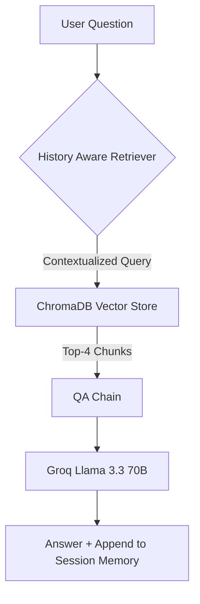

# 📄 PDF Question Answering Assistant (RAG Pipeline)

**Participant Name**: Athira V  
**MUID**: athirav-3@mulearn  
**Project Repository**: https://github.com/Athi183/day_11_epoch_task  


---

## 🌟 Project Overview

The **PDF Question Answering Assistant** is a production-ready, open-source Retrieval-Augmented Generation (RAG) system that allows users to upload any PDF document and ask unlimited context-grounded questions. The application combines **LangChain 0.3.x**, **ChromaDB**, **HuggingFace Embeddings (`sentence-transformers/all-MiniLM-L6-v2`)**, and **Groq (`llama-3.3-70b-versatile`)** with an interactive **Gradio** web interface.

---

## ✨ Features

- **Document Processing**: Automatic parsing with `PyPDFLoader` and text chunking using `RecursiveCharacterTextSplitter` (`chunk_size=1000`, `chunk_overlap=200`).
- **Progress Tracking**: Real-time status updates reporting document filename, total pages loaded, and text chunks generated.
- **High-Performance Embeddings**: Semantic embeddings generated locally using `sentence-transformers/all-MiniLM-L6-v2`.
- **In-Memory Vector Search**: Rapid similarity retrieval (`k=4`) powered by ChromaDB.
- **History-Aware Retrieval**: Multi-turn dialogue support using `create_history_aware_retriever` to reformulate follow-up questions in context.
- **Strict Non-Hallucination Guardrails**: Powered by Groq's `llama-3.3-70b-versatile` at zero temperature. If context does not contain the answer, returns:
  > *"I couldn't find that information in the uploaded PDF."*
- **Conversational Memory Lifecycle**: Managed per session using `RunnableWithMessageHistory`. Uploading a new PDF automatically resets memory and rebuilds the vector database.
- **Hugging Face Spaces Ready**: Pre-configured for deployment on Hugging Face Spaces or local servers.

---

## 🛠️ Technologies Used

| Layer | Technology |
| :--- | :--- |
| **Language** | Python 3.10+ |
| **Web Interface** | Gradio 6.x / 5.x |
| **RAG Orchestration** | LangChain 0.3.x (`langchain`, `langchain-core`, `langchain-community`, `langchain-text-splitters`) |
| **LLM Provider** | Groq API (`llama-3.3-70b-versatile`) |
| **Embeddings** | HuggingFace (`sentence-transformers/all-MiniLM-L6-v2`) |
| **Vector Store** | ChromaDB (`langchain-chroma` / `chromadb`) |
| **PDF Loader** | `pypdf` (`PyPDFLoader`) |
| **Environment Management** | `python-dotenv` |

---

## 📂 Folder Structure

```text
pdf-rag-chatbot/
│
├── app.py              # Core application entry point & RAG pipeline
├── requirements.txt    # Production dependencies with pinned versions
├── README.md           # Project documentation & execution guide
├── .env.example        # Environment variable template
└── .gitignore          # Git exclusion rules
```

---

## ⚙️ Installation

1. **Clone the repository**:
   ```bash
   git clone https://github.com/your-username/pdf-rag-chatbot.git
   cd pdf-rag-chatbot
   ```

2. **Create and activate a virtual environment**:
   ```bash
   # On Linux / macOS:
   python3 -m venv venv
   source venv/bin/activate

   # On Windows:
   python -m venv venv
   venv\Scripts\activate
   ```

3. **Install dependencies**:
   ```bash
   pip install -r requirements.txt
   ```

---

## 🔑 Environment Variables

1. Get a free API Key from [console.groq.com](https://console.groq.com).
2. Copy `.env.example` to `.env`:
   ```bash
   cp .env.example .env
   ```
3. Open `.env` and set your key:
   ```env
   GROQ_API_KEY=gsk_your_actual_groq_api_key_here
   ```

---

## 🚀 Running Locally

Launch the application:

```bash
python app.py
```

Open your browser and navigate to: **`http://localhost:7860`**

---

## 🌐 Deployment (Hugging Face Spaces)

1. Create a new Space on [Hugging Face Spaces](https://huggingface.co/new-space) using **Gradio** SDK.
2. Push `app.py`, `requirements.txt`, `README.md`, and `.gitignore` to the Space repository.
3. In **Settings -> Variables and Secrets**, add a Secret:
   - **Key**: `GROQ_API_KEY`
   - **Value**: `gsk_...`
4. The Space will automatically build and launch!

---

## 🧠 Memory Implementation & Lifecycle

The application utilizes **`RunnableWithMessageHistory`** combined with **`ChatMessageHistory`** to preserve multi-turn context:



- **Session Isolation**: Chat history is tracked per session using `get_session_history()`.
- **Upload Reset**: Uploading a new PDF invokes `session_store.clear()` and disposes of the previous `vectorstore` instance to prevent cross-document memory leaks.
- **Manual Reset**: Clicking **Clear Chat** resets conversation history without needing to re-process the PDF.

---

## ⚡ Challenges Faced & Solutions

1. **Gradio 5/6 Migration & Message Formats**:
   - *Challenge*: Newer Gradio versions transitioned `gr.Chatbot` from tuple pairs to structured dictionary messages (`{"role": "...", "content": "..."}`).
   - *Solution*: Refactored chat handlers to output standardized role-content dictionaries.

2. **Hallucination Prevention**:
   - *Challenge*: Open-domain LLMs tend to extrapolate beyond document context.
   - *Solution*: Enforced strict system prompt guardrails with `temperature=0` instructing the model to respond *exactly* with `"I couldn't find that information in the uploaded PDF."` when out-of-context.

---

## 🔮 Future Improvements

- **Multi-File PDF Processing**: Support simultaneous uploading and merging of multiple PDFs into a single vector database.
- **Source Citation & Highlights**: Display page numbers and extracted text snippets alongside answers.
- **Hybrid Retrieval**: Combine BM25 keyword search with dense vector retrieval for improved accuracy on complex terms.

---
